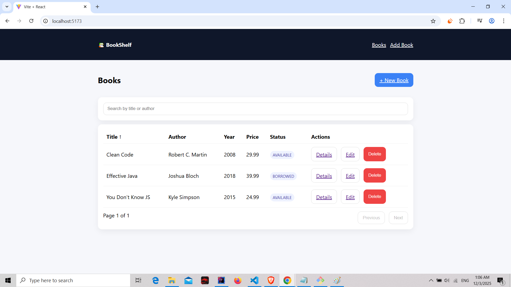
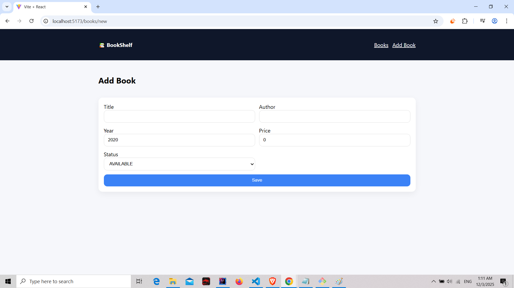
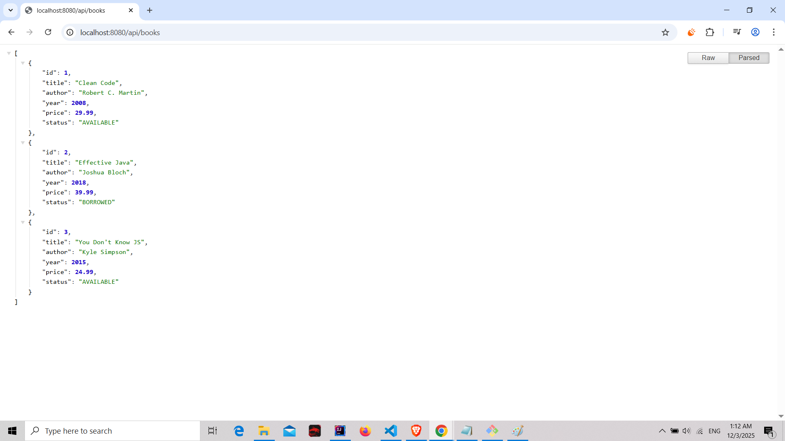

<h1>📚 Books Library CRUD</h1>

A full-stack CRUD application built with Spring Boot, React (Vite), Axios, and an H2 in-memory database.

<h2>🚀 Features</h2>

- Add, edit, delete, and list books

- Search books by title or author

- Clean and responsive UI

- RESTful API using Spring Boot

- H2 in-memory database (no installation required)

<h2>🛠️ Tech Stack</h2>

<h3>Frontend</h3>

 - React (Vite)

 - Axios

 - CSS

<h3>Backend</h3>

 - Spring Boot

 - Spring Web

 - Spring Data JPA

  - H2 Database

<h2>▶️ How to Run the Project</h2>

 <h3>1️⃣ Run the Backend (Spring Boot)</h3> 

cd backend

mvn spring-boot:run

The backend will run on:
http://localhost:8080

  <h3>2️⃣ Run the Frontend (React)</h3>

cd frontend

npm install

npm run dev

Frontend will run on:
http://localhost:5173

<h2>🔌 REST API Endpoints</h2>

| Method | Endpoint               | Description      |
| ------ | ---------------------- | ---------------- |
| GET    | `/api/books`           | Get all books    |
| GET    | `/api/books/{id}`      | Get a book by ID |
| GET    | `/api/books/search?q=` | Search books     |
| POST   | `/api/books`           | Add a new book   |
| PUT    | `/api/books/{id}`      | Update a book    |
| DELETE | `/api/books/{id}`      | Delete a book    |

<h2>🎥 Demo Video</h2>

A short demonstration of the project:
https://youtu.be/xomYjQ-ol08

<h2>🖼️ Screenshots</h2>

  

  📘 Main Page

  ➕ Add Book Page

  🔌 API JSON Response

<h2>📦 Project Structure</h2>

books-library-crud/

    ├── backend/
   
    ├── frontend/
   
    └── README.md

   
<h2>📄 License</h2>

This project is open-source and free to use for learning and portfolio purposes.  
You may reuse the code with proper credit.  
Feel free to modify it as needed.

<h2>🙋‍♂️ Author</h2>

Ayoub Khettabi
Full-Stack Developer (React + Spring Boot)

GitHub: https://github.com/KhettabiAyoub

LinkedIn:https://www.linkedin.com/in/ayoub-khettabi-1a0026151/

